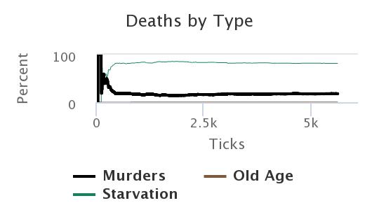
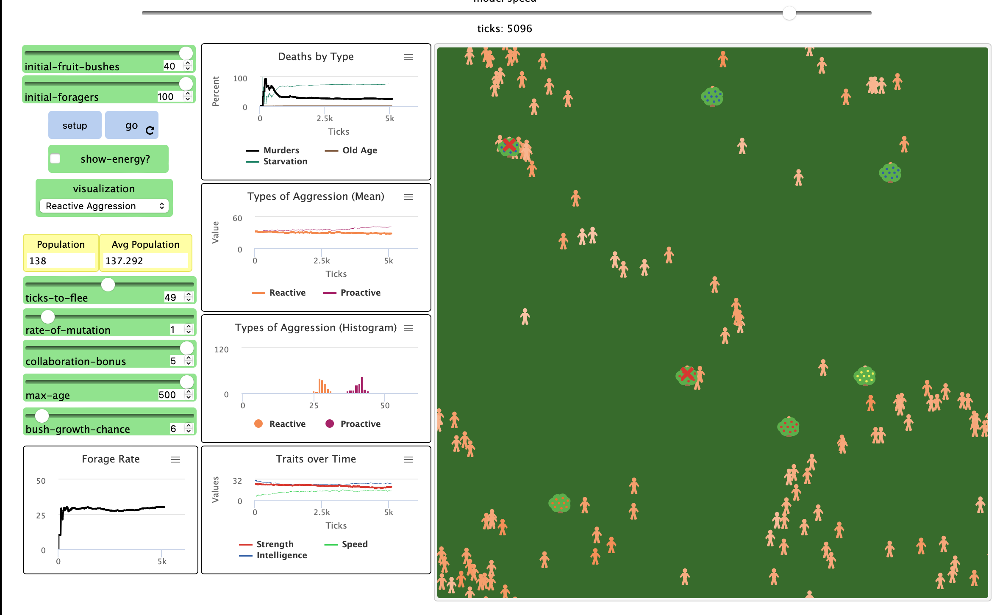
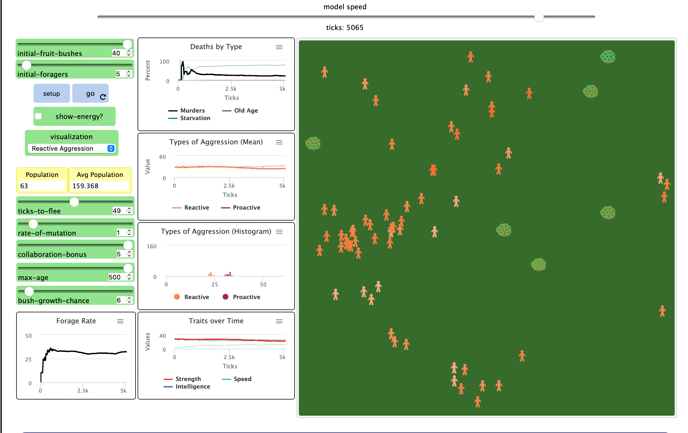
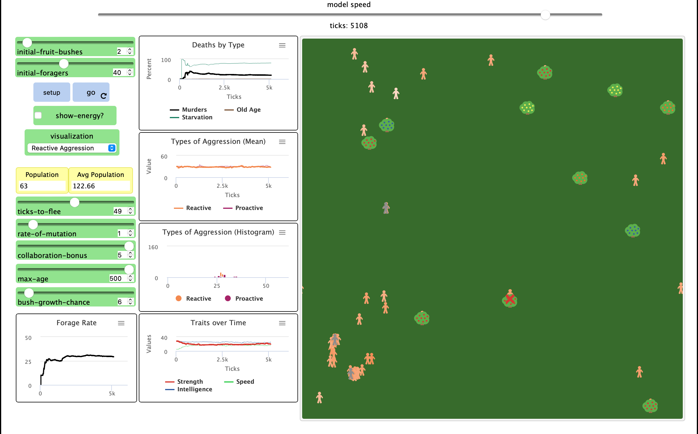
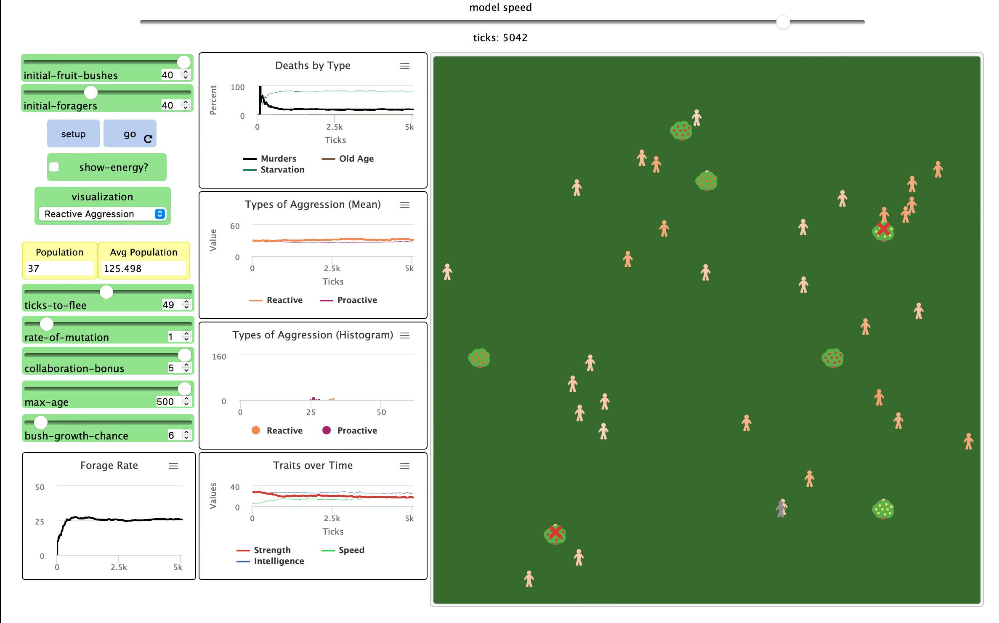

## Комп'ютерні системи імітаційного моделювання
## СПм-22-5, **Колесник Захар Володимирович**
### Лабораторна робота №**1**. Опис імітаційних моделей та проведення обчислювальних експериментів

 

### Варіант 13, модель у середовищі NetLogo:
[Fruit Wars](http://www.netlogoweb.org/launch#http://www.netlogoweb.org/assets/modelslib/Sample%20Models/Social%20Science/Economics/Fruit%20Wars.nlogo).

 

### Вербальний опис моделі:
Симуляція боротьби за обмежені ресурси у різних групах людської популяці. Кожен збирач дотримується набору правил: 
- рухатись випадково якщо поблизу нема кущів
- якщо поблизу є кущ, рухатись у його напрямку споживаючи 1 одиницю енергії
- якщо біля куща є інші сбирачі, прибуваючий сбирач може загрожувати або співпрацювати ймовірнісно на основі свого значення реактивної агресії. 
- якщо кущ поблизу проводити збір (споживати енергію)
- якщо енергія куща закінчуеється кущ вмирає та усі збирачі поруч переходять до статусу пошук
- якщо енергія збирача більше 200, то розмножуватяь витрачаючи 100 одиниць енергії
- якщо закинилась енергія або вік збирача вище за параметр **max-age** збирач вмирає

### Початкові параметри:
- **initial-fruit-bushes** визначає килькість кущів з початку
- **initial-foragers** визначає килькість збирачів з початку

### Параметри візуалізаціі:
- **show-energy** відображає поточну енергію кожного окремого сбирача на екрані, якщо ця функція активована.
- **visualisation** масштабує колір агента в залежності від значення вибраного параметра, де світлі кольори відображають вищі значення цього параметра.

### Керуючі параметри:
- **ticks-to-flee** кількість тактів пересування збірника фруктів перш ніж він почне поук кущів.
- **rate-of-mutation** верогідність зміни біта у геномі при передачі його до потомства.
- **collaboration-bonus** фактор співпраці, підвищує швидкість сбору поживи для кількох сбирачів біля одного куща.
- **max-age** максимальна кількість тактів, протягом яких окремий сбирач може жити, коли цей ліміт досягається, сбирач помертає.
- **bush-grow-chance** визначає вирогідність появи нового фруктового куща на кожному такті.

### Показники роботи системи:
- смертність серед сбирачів та розподіл смертей за причинами.
- реактивна/проактивна агресія
- динаміка характеристик збирачів.
- динаміка населення.
- кількість випадків насильства у системі.

### Примітки:
- при налаштуваннях керуючих параметрів за замовчуванням, збирачі помирають або від голоду або від вбивств, не доживаючи до старості.
- коли кущі закінчуються населення починає падати, потім кущів починає ставати більще ніж збирачів і населення починає знову зростати, тобто по колу.
- якщо зменщити фактор спивпраці, помітно що середьне населення в перспективі значно нижче, так як періодичне пікове ссягання показнику населення нижче.

### Недоліки моделі:
- модель дуже спрощена репрезентація складної реальної системи і таким чином, не враховує всі можливі фактори, що впливають на співпрацю та насильство в реальних умовах.
- треба додати рейт колабораціанізму до графіку агресіі щоб бачити залежності співпраці та насильства
 

## Обчислювальні експерименти

### 1. Вплив фактору співпраці на середній показник населення
Досліджується показник сернього населення від фактору співпраці на 5000 килькості тактів.
Експерименти проводяться при 40 збирачах, 40 кущах.
- **collaboration-bonus** 5: показник середньго населення близько 140
- **collaboration-bonus** 1: показник середньго населення близько 50 
- в обох випадках графік показує що смертність від вбивства падає, а смертність від голоду зростає.

### 2. Вплив початкової кількості збирачів на показники
Досліджується показники в залежності від початкової кількості збирачів на 5000 килькості тактів.

100 збирачів

5 збирачів

В обох випадках тенденція графіків подібна, тобто початкова кількість збирачів не вплває на перспективу.
Едине на що трішки вплинуло це графік агресіі, його пікові значення стали дещо нижче, але динаміка залишилась попередноью.
Звістно якщо вона становить з одного збирача, тоді іноді модель не доходить до першої репродукціі і населення залишаться на рівні одиниці та живе проблизно всього на протязі прблизно 100 тактів.

### 2. Вплив початкової кількості кущів на показники
Досліджується показники в залежності від початкової кількості кущів на 5000 килькості тактів.

2 кущів

40 кущів

В обох випадках тенденція графіків подібна, тобто початкова кількість взагалі кущів не вплває на перспективу.

